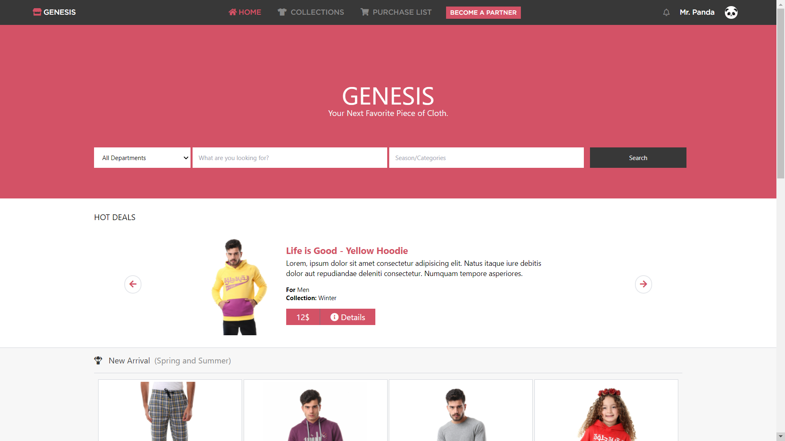
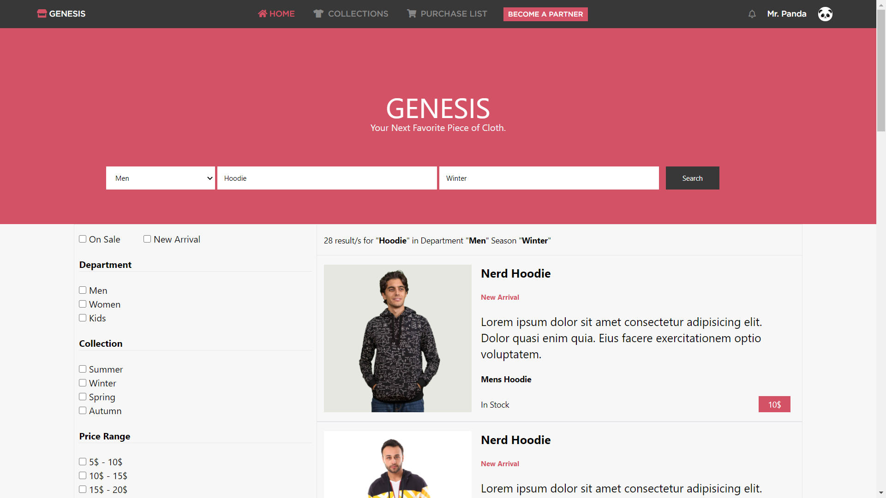

# Genesis Shop - Capstone Project

> An e-commerce website. Users can sell and buy different kinds of apparel. Built with Tailwind CSS and HTML5.

Genesis Shop is an adaptation to [this design](https://www.behance.net/gallery/24796463/ZATTIX). To better suit the cloth industry and how different partners can sell on that shop. Screenshots:

#### Home Page:

#### Search Results Page:

## Built With

- HTML5
- CSS3
- Sass
- Tailwind CSS

## Live Demo

[Live Demo Link](https://omar-labana.github.io/genesis-shop/)

## Getting Started

**To get a local copy up and running follow these simple steps.**

### Prerequisites

- Web browser.

### Setup

- Download/Clone the repository files and navigate to index.html.

### Install

- No installation required.

### Deployment

-You can deploy this project by cloning it then:

- Goto the repository's settings.
- Navigate to GitHub Pages section.
- Select the appropriate branch.
- Submit your changes.

## Author:

👤 **Omar Labana**

- GitHub: [@omar-labana](https://github.com/omar-labana)
- Twitter: [@panda4cs](https://twitter.com/Panda4cs)
- LinkedIn: [Omar Labana](https://www.linkedin.com/in/omarlabana/)

## 🤝 Contributing

Contributions, issues, and feature requests are welcome!

## Show your support

Give a ⭐️ if you like this project!

## Acknowledgments

- [Microverse](https://www.microverse.org/)
- [Mohammed Awad](https://www.behance.net/gallery/24796463/ZATTIX)
- [NAS Trends](https://www.nastrends.com/)

## 📝 License

This project is [MIT](https://opensource.org/licenses/MIT) licensed.